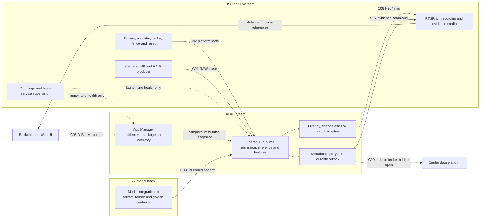
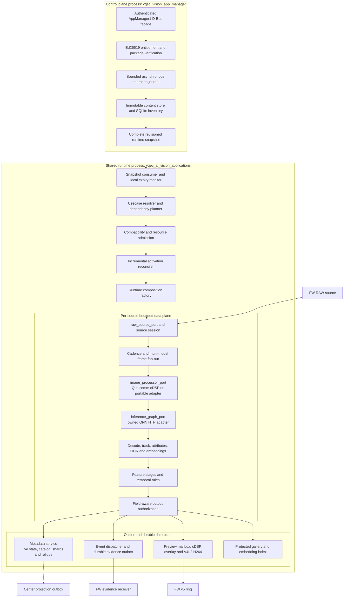
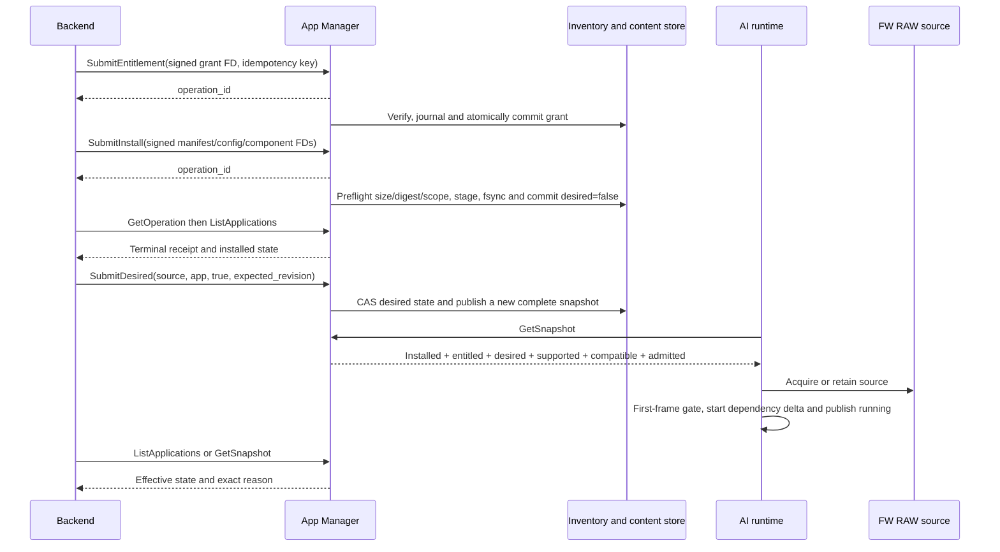
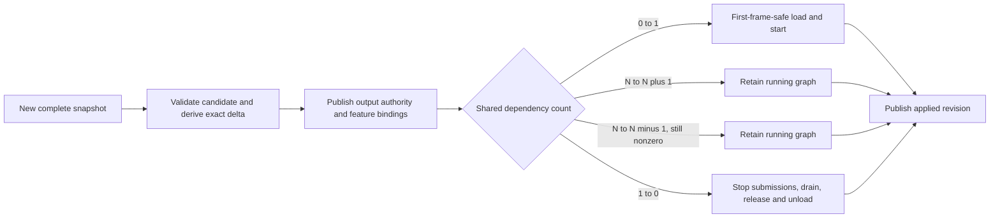
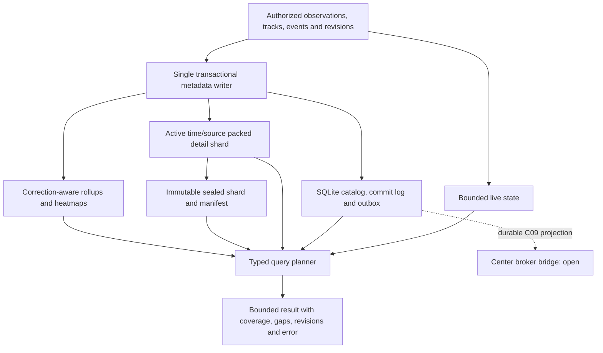
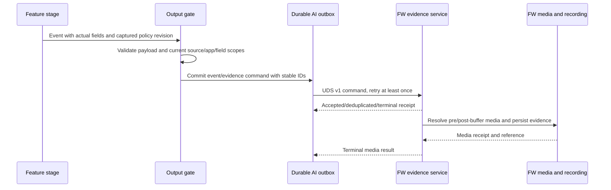

# End-to-end system operation and team boundaries

This document is the current end-to-end view of the LACAI product: team ownership,
cross-team contracts, application lifecycle, runtime data flow, metadata, evidence and
preview delivery. It is a synthesis, not a replacement for the normative contract or
capability documents linked below.

**Status:** reference — synchronized with the accepted C01–C10 ownership baseline and the
2026-09-20 implementation/evidence snapshot; external release gates remain explicit.
**Layer:** reference. **Source:** `n/a`.

## Responsibility

- Give product, backend, BSP+FW, AI APP and AI Model teams one consistent system view.
- Distinguish control-plane state from the inference data plane and durable data plane.
- Describe startup, installation, activation, frame processing, output and shutdown flows.
- Show the detailed AI APP layering and the neutral ports that preserve portability.
- State what is delivered, what has board evidence and what is still a release gate.

Normative ownership comes from the
[three-team integration registry](../contracts/integration_contract_registry.md). Current
delivery claims come only from [implementation status](../development/implementation_status.md)
and the [capability matrix](../development/capability_matrix.md).

## Product topology

The commercial unit is one usecase application, but applications are not operating-system
processes. One AI-owned App Manager manages packages and authority. One shared AI runtime
executes all effective applications and reference-counts compatible shared models, sources and
other components.



The backend is a product peer, not a fourth owner of AI authority. It submits signed grants and
requested state through the AI APP-owned D-Bus contract. It cannot assert `entitled`,
`compatible`, `admitted` or `running`. BSP+FW may launch and monitor the two AI processes, but it
does not own usecase package inventory or activation semantics.

## Team scope and handoff

| Area | BSP+FW owns | AI APP owns | AI Model owns |
|---|---|---|---|
| Camera input | Sensor, ISP, decode, RAW allocation, lease producer, cache/fence facts | Validate descriptor, retain/release lease, source epoch and bounded scheduling | Input conditions and supported image domain |
| Accelerator | Driver/firmware/SDK image, reset and hardware completion facts | Vendor adapter, admission, buffer lifetime, QNN/HTP/DSP composition | Target-compatible artifact and measured resource envelope |
| Model delivery | Target and SDK compatibility facts | Authenticate, validate, integrate, decode and accept/reject | Complete C03 kit, golden data, quality and limitations |
| App lifecycle | Base OS and process supervision only | Catalog, entitlement, package store, install/update/rollback/uninstall, configuration and desired state | No runtime authority; supplies immutable model payloads |
| Usecase runtime | External source/output availability | Dependency graph, cadence, tracking, feature rules, output authorization and health | Model semantics and quality |
| Metadata | External time/calibration facts when authoritative | C04/C06 schemas, live state, local history, query, retention and corrections | Attribute/ontology semantics required by C03 |
| Event/evidence | Durable FW receiver, prebuffer, media production, receipt and persistent media | C07 event meaning, authorization, durable command/outbox and correlation | Model signal only; never declares the final alarm contract |
| Preview | RTSP, UI, recording and released ring consumer | Overlay, H264 encode, released-ring writer and output gate | No ownership |
| Cloud | Network/system bridge when selected | C09 projection, authorization, deduplication and outbox | No ownership |
| Acceptance | C01/C02/C07/C08/C10 conformance receipts | Integration and end-to-end acceptance | C03 golden and model-quality receipts |

One owner controls the meaning of a contract. A producer receipt proves a particular artifact,
target and test run; it does not transfer ownership or grant runtime authorization.

## Cross-team communication

| Boundary | Direction | Version 1 mechanism | Completion and authority |
|---|---|---|---|
| App lifecycle C05 | Backend to App Manager | System D-Bus; asynchronous methods; Unix FDs for signed grant, manifest, configuration and components | Returned operation ID means queued only. Caller polls the durable operation and then fetches the complete snapshot. AI APP derives trusted gates. |
| Runtime control C05 | App Manager to AI runtime | Neutral snapshot port; current production adapter polls complete revisioned snapshots over D-Bus | A signal is only a wake-up. Missing, stale or incomplete state never enables an app. |
| RAW source C01 | FW to AI runtime | Versioned source port; current compatibility transport is Unix `SOCK_SEQPACKET` plus `SCM_RIGHTS` FD and session-owned ACK | ACK only after the final hardware reader completes. Timeout, disconnect and FD close are not completion. |
| Accelerator C02 | BSP to Qualcomm adapter | Released driver/SDK ABI and reviewed platform profile | BSP owns cache/fence/reset truth; AI APP rejects missing or incompatible facts. |
| Model kit C03 | AI Model to AI APP | Immutable package/catalog handoff with manifest, hashes, tensor/preprocess/decode contract and M0–M6 evidence | Offline release handoff, not runtime IPC. AI APP integrates only accepted exact revisions. |
| Scene/time C04 | FW/platform facts to AI APP | Versioned scene, clock mapping and calibration records | Unknown revision or uncertainty remains explicit; zero is not a valid substitute. |
| Event/evidence C07 | AI APP to FW media service | Bounded Unix `SOCK_SEQPACKET` v1 command and terminal receipt, backed by SQLite outbox | At-least-once by `event_id`/request ID. Transport ACK and media receipt are different states. Released-FW receiver acceptance is open. |
| Preview C08 | AI APP to FW | H264 access units in the released FW v5 shared ring | One writer per ring; sequence/keyframe/generation rules apply. FW owns RTSP/UI/recording. |
| Metadata C06 | UI/backend to AI-owned service | Typed bounded query contract over local catalog, live state, detail shards and rollups | Result includes coverage, gaps, revisions and authorization; an empty result is not an unsupported query. Product API facade remains integration work. |
| Cloud C09 | AI APP to center | Durable projection/outbox; Kafka-class bridge is planned | Local commit, broker ACK and data-lake commit are separate receipts. Transport implementation remains open. |

D-Bus is intentionally used for low-rate control and configuration. It is not the frame,
high-rate event or evidence-media transport.

## Stable usecase catalog

The v1 registry reserves S01–S18. `partial` means that at least one reusable dependency exists;
it does not mean the usecase is product-qualified. `unsupported` is an explicit activation
result, not a silent CPU fallback.

| Code | Stable usecase ID | Product meaning | Current catalog state |
|---|---|---|---|
| S01 | `security.restricted_area_smoking` | Smoking in a restricted area | unsupported |
| S02 | `security.suspicious_weapon` | Suspicious weapon detection | unsupported |
| S03 | `security.ppe_compliance` | Helmet and reflective-vest compliance | unsupported |
| S04 | `security.fire_smoke_detection` | Fire and smoke detection | partial; first real App Manager/runtime slice |
| S05 | `security.blacklist_person_alert` | Blacklist-person alert | partial |
| S06 | `security.attendance_recognition` | Recognition and attendance | partial |
| S07 | `security.demographic_estimation` | Age/gender estimation | unsupported |
| S08 | `security.people_density_heatmap` | Time-based people-density heatmap | partial |
| S09 | `security.unauthorized_intrusion` | Unauthorized intrusion | partial |
| S10 | `security.people_entry_exit_count` | Entry/exit counting | partial |
| S11 | `security.person_tracking` | Person tracking | partial |
| S12 | `security.vlm_context_alert` | Contextual VLM alert | unsupported |
| S13 | `security.abandoned_or_removed_object` | Abandoned or removed object | unsupported |
| S14 | `security.lost_item_trace` | Lost-item trace | unsupported |
| S15 | `security.luggage_cart_tracking` | Luggage and cart tracking | unsupported |
| S16 | `security.vehicle_plate_recognition` | License-plate recognition | unsupported |
| S17 | `security.crowd_gathering` | Crowd gathering | partial |
| S18 | `security.abnormal_fight_conflict` | Fight or conflict detection | unsupported |

Traffic applications will receive new stable IDs. They reuse the entity, observation, track,
attribute, relation, event, calibration and trajectory foundation; they do not reinterpret the
security IDs.

## AI APP process architecture



### Layer rules

| Layer | Main responsibility | Forbidden dependency |
|---|---|---|
| Contracts/ports | Stable neutral descriptors, state and ownership semantics | Vendor, D-Bus, SQLite, GStreamer or FW-private types |
| Core | Validation, status, geometry, clocks, leases and bounded primitives | Product composition and SDK calls |
| Runtime | Scheduling, admission, component lifecycle, reference counts and source epochs | Direct Qualcomm/FW transport dependencies |
| Perception | Decode, track, attributes, pose, embeddings and OCR | Commercial enablement and transport policy |
| Features | Usecase rules, windows, zones, relations and event formation | Direct model loading, media encoding or storage engines |
| Outputs | Authorization, serialization and delivery policy | Feature-specific inference logic |
| Adapters | Camera, D-Bus, SQLite, Qualcomm, FW ring and UDS implementation details | Authority changes outside their port contract |
| App | Composition root and process lifecycle | Per-frame business algorithms |

The composition root may know concrete adapters. Runtime, perception and features depend only on
neutral ports, allowing another vendor backend without changing usecase algorithms.

## Complete operating flow

### Independent cold start

AI APP does not require FW, camera, backend or App Manager to start first.

```mermaid
sequenceDiagram
    participant S as AI runtime
    participant A as App Manager
    participant F as FW RAW source
    participant Q as Qualcomm adapter

    S->>S: Load bounded deployment configuration
    alt App Manager unavailable or no effective app
        S->>S: Stay control-only; no source lease and no QNN/HTP/DSP load
        S-->>A: Poll complete snapshot with bounded backoff
    else Effective app exists
        S->>A: GetSnapshot(last_revision)
        A-->>S: Complete trusted snapshot
        S->>S: Resolve, validate and admit candidate
        S->>F: Acquire one RAW source lease/session
        F-->>S: First valid frame and source epoch
        Note over S,Q: First-frame gate protects Qualcomm from no-frame load faults
        S->>Q: Load/start only referenced graphs
        Q-->>S: Running or exact failure
        S->>S: Publish applied revision and effective state
    end
```

If camera data disappears before graph activation, the service waits without loading the
accelerator. If App Manager restarts, the last non-expired committed snapshot may continue; no
new authority is inferred. Locally observed entitlement expiry still revokes output.

### Entitle, install and enable an application



Install never enables an app automatically. Package knowledge or a copied file never grants
entitlement. Uninstall changes inventory but does not silently delete business metadata.

### Enable, disable and reconfigure without restarting other apps

For each `(source_id, app_id)`, effective activation is:

```text
installed AND entitled AND desired AND supported AND compatible AND admitted
```

The runtime computes dependency counts from effective consumers, not from UI switches.



An output-scope reduction is applied before old work can be delivered. A configuration-only
change rebuilds the affected feature owner; it does not restart unrelated sources or graphs.
Artifact identity, source profile or prepared-capacity changes may require source-local generation
replacement. Uncertain DMA/FastRPC completion remains a process/recovery boundary.

### Per-frame inference and feature flow

```mermaid
flowchart LR
    RAW[FW RAW NV12 FD lease] --> RX[Validate descriptor and epoch]
    RX --> CAD[Per-model rational cadence]
    CAD --> RET[Retain one frame owner for due readers]
    RET --> DSP[cDSP preprocess or ROI alignment]
    DSP --> QNN[QNN HTP inference]
    QNN --> CORR[Ticket and frame correlation]
    CORR --> DEC[Decoder and coordinate inverse]
    DEC --> TRACK[Tracker and attribute cache]
    TRACK --> RULE[Usecase temporal and relation rules]
    RULE --> OG[Output gate using captured policy revision]
    OG --> MD[Metadata observations and aggregates]
    OG --> EV[Alarm and evidence request]
    OG --> OV[Overlay commands]
    OV --> ENC[V4L2 H264 encoder]
    ENC --> RING[FW v5 encoded ring]
    RET -. final hardware completion .-> ACK[Release lease and ACK FW]
```



One source is acquired once and fanned out to due model graphs. A dependent ROI model retains the
exact source frame until its secondary completion. Every queue, pool, outstanding job, object
count and retry set is bounded. Frame identity always includes source, epoch, sequence and
monotonic time; a source reset clears incompatible tracker/temporal state and records a gap.

Preview cadence is independent of inference cadence. The latest-wins preview mailbox prevents a
slow model from reducing the 30 FPS video path. No viewer means no preview frame submissions; it
does not automatically disable inference.

### Metadata, trajectory and query flow



The design deliberately avoids one ever-growing database. Recent object paths use sampled,
frame-correlated track points; sealed detail shards preserve month-scale reconstruction without
writing every video frame. Cross-camera footprints are revisioned associations, not an assertion
that local tracker IDs are global identities. Fire/smoke counts, time buckets, hot regions,
duration and evidence correlation are served by event facts and rollups rather than rescanning
all detections.

Q01–Q30 describe stable query capability groups across the eighteen security applications and
future traffic applications. A query reports retained resolution, time/scene/calibration
revision, coverage gaps and uncertainty. Unsupported, denied, expired, not-observable,
coverage-gap and empty are different outcomes.

### Alarm and evidence flow



AI APP never treats a D-Bus reply, socket send or generic ACK as proof that evidence media exists.
FW owns the prebuffer, media production, recording and media receipt. The AI-side durable outbox,
authorization and UDS client exist; the released-FW receiver and C07 acceptance remain open.

### Stop and fault handling

Normal stop order is fixed:

1. Revoke output and reject new submissions.
2. Drain queued calls, completions, dependent ROI work and encoder jobs.
3. Release RAW leases only after the last hardware reader is complete.
4. Stop/unload graphs whose reference count reached zero.
5. Close source/output sessions and persist terminal state.

A timeout reports `draining`, `faulted` or `recovery_required`; it never fabricates completion.
Clean camera loss can replace a drained source generation. The current board candidate does not
automatically recover a FastRPC invocation stuck by mid-inference camera loss within the tested
180-second window; that condition remains a full-process replacement boundary.

## Lifecycle truth model

The following states must remain independently observable:

```text
catalogued -> entitled -> installed -> desired -> supported
           -> compatible -> admitted -> loaded -> running
```

A later state cannot be used to manufacture an earlier one. `desired=true` does not mean
running. `installed=true` does not mean entitled. A catalog row does not mean source/model
support. UI controls are projections of trusted state, not enforcement boundaries.

Typical terminal or degraded reasons include `disabled`, `denied`, `unsupported`,
`incompatible`, `resource_exhausted`, `expired`, `source_unavailable`, `draining`, `faulted` and
`recovery_required`.

## Current delivered scope

| Capability | Current evidence level | Important boundary |
|---|---|---|
| Three-team C01–C10 registry and S01–S18 IDs | accepted contract baseline and machine checks | Producer target/model receipts are still required |
| AI-owned App Manager | source-delivered and QCS6490 board-smoke | Backend conformance, trust rotation and electrical power-cut qualification are open |
| S04 lifecycle | Fresh entitlement, install, enable, update, rollback, uninstall/reinstall and repeated toggle passed on QCS6490 | S04 remains `partial` until model-quality and released-FW gates pass |
| Incremental per-app activation | accepted runtime mechanism; QEMU/native races and QCS6490 two-app fixture passed | Second product app and eighteen-app capacity are not yet qualified |
| Qualcomm hot path | cDSP preprocess/overlay, QNN HTP inference and V4L2 H264 path run at 30 FPS in the recorded workload | No universal multi-vendor backend or full DMA/fence proof |
| Perception and recognition foundations | Detection, cascade, tracking baseline, protected gallery and embedding index are source-delivered with scoped smoke evidence | FR quality, liveness and attendance acceptance are open |
| Metadata/query P2 | accepted architecture and implementation with transaction, fault and board workload evidence | Product query facade, Kafka P3 and cross-device analytics remain open |
| Event/evidence AI side | authorization, SQLite outbox, retry/revoke and UDS v1 client are source-delivered with board reference evidence | Released-FW receiver, prebuffer/media receipt and C07 acceptance are open |
| Preview | AI overlay, H264 encode and FW v5 ring writer passed the recorded board workload and visual review | Released-FW coexistence, routing and long soak remain open |

The recorded S04 candidate produced H264 1920x1080 at approximately 30 FPS. Its exact five-minute
measurement was 10.835% service CPU plus 3.759% App Manager CPU of one logical core. This is one
workload snapshot, not proof that all eighteen applications meet the capacity target or that the
system is leak-free under release soak.

## Release gates still open

- BSP+FW receipts for released camera/ring/RTSP/evidence behavior, DMA completion,
  cache/fence/reset and coexistence.
- AI Model M2–M6 golden, quality, limitation and resource receipts for each product package.
- Product acceptance of a second application and measured capacity for the eighteen-application
  target under thermal, DDR, recording and multi-source load.
- Automatic recovery or supervised replacement for a mid-inference FastRPC stall.
- Production backend conformance to AppManager1, key rotation/revocation and electrical power-cut
  qualification.
- Released-FW evidence inbox, pre/post-buffer media receipt and end-to-end natural-event evidence.
- Kafka/center data-lake transport, cross-device association and data-lake commit receipts.
- Generic multi-vendor composition, product query/API facade and complete per-app cost attribution.

## See also

- [System architecture](system_architecture.md)
- [App Manager](app_manager.md)
- [Usecase activation](usecase_activation.md)
- [Incremental application activation](incremental_app_activation.md)
- [Runtime composition factory](runtime_composition_factory.md)
- [Spatiotemporal metadata](spatiotemporal_metadata.md)
- [Feature event dispatch](feature_event_dispatch.md)
- [FW–AI APP contract](../contracts/fw_ai_app_contract.md)
- [AI Model integration package](../contracts/model_integration.md)
